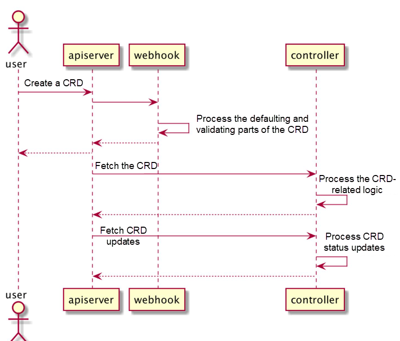
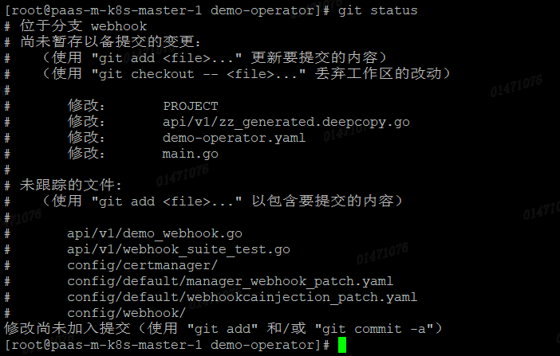

## kubebuilder（六）webhook

operator中的webhook也是很重要的一块功能。也是相对比较独立的模块，所以放在后面讲。

webhook是一个callback，注册到k8s的api-server上。当某个特定的时间发生时，api server就会查询注册的webhook，并根据一些逻辑确认转发消息给某个webhook

在k8s中，有3类webhook，[admission webhook](https://kubernetes.io/docs/reference/access-authn-authz/extensible-admission-controllers/#admission-webhooks), [authorization webhook](https://kubernetes.io/docs/reference/access-authn-authz/webhook/) 和 [CRD conversion webhook](https://kubernetes.io/docs/tasks/extend-kubernetes/custom-resources/custom-resource-definition-versioning/#webhook-conversion).

在kubebuilder的底层controller-runtime框架里，支持admission webhooks and CRD conversion webhooks。

这篇笔记讲的是admission webhook。（以下的webhook就是指admission webhook）。 CRD conversion webhooks用于多版本api转换时，目前入门阶段先不讨论这个话题。

admission  webhook又可以分成2类。

一种是校验类的webhook，只读取信息，做校验判断，不会改变消息，称为validating类型。这里的校验就可以写复杂的业务了，前面的代码里我们也配置过简单的validation校验。

```
	// +kubebuilder:validation:Required
	Image string `json:"image,omitempty"`
```

另一种就是可修改对象的webhook，比如设置默认值功能，称为mutating类型。

### 执行顺序

先执行mutating webhook，后执行validating webhook

就是说先设置，后校验。不需要担心，校验完了之后，另一个webhook又修改了值。

## 工作流




1. 用户创建一个CRD的实例
2. k8s api-server将这个请求转发给对应的webhook
3. webhook完成默认的参数配置操作，并进行一些参数校验操作。成功之后将cr返回给api-server。api-server进行落库
4. 我们编写的controller的在后台监控cr,拉取cr内容，并执行我们编写的逻辑
5. cr的执行结果同步回api-server


## 创建webhook

和创建api一样，webhook也由kubebuilder创建脚手架代码。

我们在之前的代码框架上继续操作。

```
kubebuilder create webhook --group tutorial --version v1 --kind Demo --defaulting --programmatic-validation 
```

--defaulting 是会创建配置默认值的webhook

--programmatic-validation 创建有校验功能的webhook

kubebuilder的参数

```
Flags:
      --conversion                if set, scaffold the conversion webhook
      --defaulting                if set, scaffold the defaulting webhook
      --force                     attempt to create resource even if it already exists
      --group string              resource Group
  -h, --help                      help for webhook
      --kind string               resource Kind
      --plural string             resource irregular plural form
      --programmatic-validation   if set, scaffold the validating webhook
      --version string            resource Version
```

--conversion 就是创建CRD conversion webhooks。用于多版本api转换时，现在先不用管。

执行完之后，看看生成的代码



查看main.go


作用就是在manager中注册了我们的webhook

## 业务代码

更重要的文件是生成的这个webhook文件，我们的业务代码是写在这里的


我们的Demo实现了webhook.Defaulter接口。即拥有了配置crd的默认值的能力。

稍后我们在这个Default()方法里编写配置默认值的操作。


我们的Demo实现了webhook.Validator接口，在crd进行增删改时可以进行验证操作

简单实现几个方法

```
func (r *Demo) Default() {
	demolog.Info("default", "name", r.Name)

	// TODO(user): fill in your defaulting logic.
	if r.Spec.Replicas == nil {
		r.Spec.Replicas = new(int32)
		*r.Spec.Replicas = 1
		demolog.Info("配置默认值", "replicas", *r.Spec.Replicas)
	}
}
```

```
// 创建和更新调一下validate方法
func (r *Demo) ValidateCreate() error {
	demolog.Info("validate create", "name", r.Name)

	// TODO(user): fill in your validation logic upon object creation.
	// 调用 r.validate() 方法，来验证对象的合法性。
	return r.validate()
}

func (r *Demo) validate() error {
	var allErrs field.ErrorList
	if *r.Spec.Replicas > 10 {
		err := field.Invalid(field.NewPath("spec").Child("replicas"),
			*r.Spec.Replicas,
			"副本数不能大于10")

		allErrs = append(allErrs, err)
	}

	if len(allErrs) == 0 {
		demolog.Info("参数合法")
		return nil
	}

	return apierrors.NewInvalid(schema.GroupKind{
		Group: "tutorial",
		Kind:  "Demo"},
		r.Name, allErrs)
}
```


在部署webhook前，还需要修改下配置

在config/default/kustomization.yaml中


注释全都放开

在config/crd/kustomization.yaml中


注释放开


## 部署前准备

### 安装cert-manager

因为api-server是通过https调用webhook，所以需要部署cert-manager来自动管理证书。

这也是kubebuilder官方建议的方案

```
kubectl apply -f https://github.com/cert-manager/cert-manager/releases/download/v1.7.3/cert-manager.yaml
```


因为我的测试环境是1.18的k8s，所以选择1.7版本的cert manager。


### 清理环境

先把之前测试的资源全部删除

删除测试demo

```
kubectl delete -f config/samples/tutorial_v1_demo.yaml
```

删除operator

```
kubectl delete -f demo-operator.yaml
```

删除crd

```
make uninstall
```


## 部署

```
make install
```

```
make docker-build docker-push IMG=harbor-test.xxx.net/paas/demo-operator:2.0
```

```
make deploy IMG=harbor-test.xxx.net/paas/demo-operator:2.0
```


## 测试

### 测试默认值功能

修改一下之前的yaml,去掉replicas字段

```
apiVersion: tutorial.demo.com/v1
kind: Demo
metadata:
  namespace: demo
  name: demo-sample
spec:
  image: nginx:1.22
  svcName: demo-ng
```

查看manager的日志


调用了配置默认值的代码


### 测试参数校验功能

将yaml中的replicas字段设置为15，超过我们的最大值

```
[root@paas-m-k8s-master-1 demo-operator]# kubectl apply -f config/samples/tutorial_v1_demo.yaml
The Demo "demo-sample" is invalid: spec.replicas: Invalid value: 15: 副本数不能大于10
```

直接报错

查看日志


进行了校验


